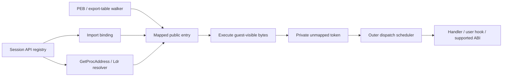

# Unified Windows API addresses

Speakeasy v2 gives each synthesized API function a stable, readable executable address in its owning module. The export table, bound imports, `GetProcAddress`, `LdrGetProcedureAddress`, and kernel routine lookup use the same session registry. Registering a handler or user hook changes dispatch behavior without changing an existing address.

This makes the returned pointer a useful debugger breakpoint and symbol address. A guest can read or patch the entry; its bytes execute before Python handles the call. Memory tracing observes execution and never decides whether to intercept a function.

Forwarder strings follow PE forwarding rules to the destination entry. Dynamic-only requests enter through the registry and resolver; they deliberately have no export-table entry.

## Modules and export surfaces

`ApiModuleLoader` combines exact DLL declarations from the signature database with explicit function and data handlers. Enumeration is independent of generic ABI support: an unsupported declaration still appears in the EAT and has a breakpointable entry. Architecture-ineligible declarations are excluded. Stacked `apihook` decorators retain every explicitly registered name; the loader does not manufacture A/W variants.

The generated PE has a read-only header and export directory, executable `.text` and `.dyn` sections, and writable `.data`. Name pointers are sorted, name ordinals index the EAT correctly, and explicit sparse ordinals retain real holes. Code and data are different export kinds. An empty placeholder is still a mapped PE with valid headers and a reserved dynamic arena.

These are broad synthetic surfaces, not inventories of a particular Windows build. Win32metadata records import-library declarations, not the complete export surface of every physical implementation DLL. PHNT declarations also do not supply exact export ordinals or forwarders. Generated ordinals are deterministic emulator identifiers unless a handler supplies an explicit ordinal. Data exports currently come from implemented data handlers. Known PHNT architecture restrictions are curated; remaining unqualified declarations have inferred availability. Supplying versioned Windows export manifests is separate work.

`PeLoader` preserves native export RVAs, ordinals, data, aliases and forwarder strings. Its exports execute guest code, even when a same-named Python handler exists. Native files selected through configured module paths use this guest policy; there is no automatic mixture of native instructions and handler interception. A guest image cannot acquire invented exports. Rebase requests require relocation data, and architecture mismatches fail before mapping.

## Public entries and private dispatch

Each synthesized function occupies a 32-byte slot. The first 16 bytes are NOP padding for patches, and the public entry starts at offset 16. The original entry is stack-neutral:

| Architecture | Public bytes |
| --- | --- |
| x86 | `8B FF` (`mov edi,edi`), followed by `E9 rel32` |
| x64 | `66 90`, followed by `FF 25 00 00 00 00` and an embedded 64-bit target |

The jump goes to a unique, permanently unmapped private token. The private reservation is 1 MiB with 16-byte token spacing. It is separate from legacy SEH and other control addresses. Allocation is monotonic, including after a failed load, so retired tokens cannot become a different API.

The invalid-memory dispatcher recognizes private controls before user fault hooks. An expected API fetch stops Unicorn and returns control to the outer execution loop. Python dispatch then runs outside the native callback. This avoids mapping fake API pages and makes breakpoint, step, interrupt and library-notification ordering explicit. Unregistered targets or data accesses in the reservation follow a nonmapping error path.

A host or debugger patch invalidates Unicorn's translated code cache. Patching a public entry to return or jump elsewhere executes those guest bytes and can bypass handler dispatch. A suspended call retains its entry bytes, SP and return slot; editing its frame or public code abandons the retained dispatch and executes the revised entry.

Real forwarders resolve through destination modules, names or ordinals, with cycle and depth checks. Missing destinations are not silently synthesized. Synthetic forwarder specifications retain real EAT forwarder strings rather than overwriting them with code. A forwarder may resolve to guest code or shared data storage.

## Dynamic-only requests

Each synthetic image reserves a 64 KiB `.dyn` arena, enough for 2,048 additional entries. Name and ordinal requests have separate keys. Repeated resolution reuses the same address. New entries never change the module's EAT, `SizeOfImage`, section layout or existing pointers.

An empty unknown placeholder can resolve dynamic-only functions. For a populated known surface, missing procedure lookups fail unless `functions_always_exist` or an explicit user hook permits synthesis. Static/injected import binding and the explicit `get_proc` interface permit dynamic placeholders for missing synthetic exports, preserving a meaningful address and later unsupported-call diagnostic. Guest PEs always remain strict. Capacity exhaustion or guest modifications to arena bytes/protections fail allocation without moving existing entries.

`functions_always_exist` controls resolution; it does not grant permission to guess a calling convention or argument count. An unknown function without a handler, user-supplied ABI, or safe exact signature logs an unsupported call and stops during ordinary dispatch. Under GDB, preflight stops before recording an API call and the original frame remains suspended so a caller can inspect it, add a hook, redirect execution, or patch the entry.

## Signature and handler dispatch

Generic dispatch uses an exact module/name/architecture declaration with source precedence. Permissive cross-DLL signature lookup remains available for formatting arguments of implemented handlers, but cannot select an unknown function's execution ABI.

Proven same-address aliases share a dispatch identity. Hooks registered under any of those names are collected once: exact-name matches precede wildcard matches, and each group retains registration order. Copied pointers retain the canonical record identity in telemetry because the original lookup name cannot be recovered from an address alone.

The generic execution gate supports scalar/pointer cdecl and stdcall declarations it can transport correctly, with the corresponding Win64 integer/pointer ABI on x64. It rejects skipped declarations, variadic calls, unsupported conventions, floating-point transport, by-value aggregates, and x86 64-bit returns. These functions remain visible and can have explicit handlers or hooks. Exceptions raised by providers during dispatch lookup are reported with the requested DLL and function rather than silently selecting another source's ABI. Bundled archive loading retains its existing behavior of treating unreadable or malformed archives as unavailable sources.

Dispatch records API events against the originating run. A handler that changes PC, SP, return address or run ownership is not automatically returned a second time. Stack-transforming handlers perform their own return. Typed callback frames preserve the originating API's return slot, stack, calling convention and result across queued and nested guest callbacks. API telemetry reflects the result after a deferred initialization failure.

## Loader and process integration

An image owns one contiguous mapped span. Regions are validated and written inside that span, exports are registered, imports are bound, and section permissions are applied before publication. Loader graph failures remove new module mappings, registry records, import bindings and PEB attachments while preserving surviving addresses and entries. Public module-change notifications occur after a coherent load graph is available.

Ordinary and delay imports share the import inventory and binder. Native delay imports are bound eagerly; legacy VA-form descriptors are handled when rebasing. Injected import repair validates architecture and bounds descriptor, thunk and string reads by the mapped image. Binding bookkeeping is separate from callable address ownership.

Each process has its own loader entries. List heads are real sentinels with reciprocal forward/back links, including empty lists. The main image is first in load/memory order and excluded from initialization order. Core/default DLLs are attached during PEB allocation; subsequent reinitialization preserves that process's actual membership. Cached loads attach only to the selected process, and kernel/invisible modules stay out of user PEBs. Allocating another PEB does not replace the running thread's FS/GS PEB pointer.

Native DLL dependencies initialize under the outer scheduler, in completed dependency-load order, with TLS callbacks before DllMain. Only modules attached to the current process are eligible, with initialization state tracked per process. Runtime library loading uses deferred guest callback frames. Reentrant loads see initialization state and do not schedule the same module twice. Failed DllMain returns roll back new attachments and unowned new mappings while preserving another process's surviving cached module; `LdrLoadDll` also clears its output handle and returns `STATUS_DLL_INIT_FAILED`. Synthetic APIs have no invented initializer.

Speakeasy still uses a shared emulated address space. Per-process PEB membership is not virtual-address-space isolation; module data can remain shared. Complete Windows reference counting, API-set schema/build fidelity, native TLS semantics, special `LoadLibraryEx` mapping modes and DLL unload notifications remain broader loader limitations.

## Debugger limits and symbols

A resume or step is one logical action across private yields. Stepping the final trampoline jump completes the intercepted call or guest transfer without executing a caller instruction. Pending watchpoints or interrupts stop before dispatch. Memory watchpoints stop at a completed instruction boundary so resuming does not repeat a guest write.

Instruction limits are per run and persist across debugger actions and API yields. Synthesized guest instructions count; Python handling does not. Active execution time is cumulative across actions, including Python handling, and excludes time paused in the debugger. Timeout/instruction exhaustion produces a typed stop rather than passing zero to Unicorn as an unlimited budget. Completed callback/run-return controls are finalized even at an exact instruction boundary. Cancellation is checked before restarting native execution.

Existing `get_symbol_from_address(address)` resolves public entries and trampoline interiors. `Speakeasy.get_api_symbols()` returns a snapshot of mapped function/data labels, including dynamic-only entries and internal callback entries. It excludes private tokens and EAT forwarder strings. Take a new snapshot after resolving additional modules or functions; PE exports alone intentionally omit dynamic-only symbols.

Genuine memory faults remain terminal for the current run after debugger inspection. Register or PC edits at those fault stops do not make the run resumable. Ordinary analysis retains legacy recovery for anonymous non-executable code, including invalid empty-stack export invocations; module/API section permissions remain authoritative. Fault completion waits for native execution to unwind so errors cannot be attributed to the next queued run. The resumable unsupported-API preflight described above is a separate path.

## Migration

- Import pointers and resolver results are mapped addresses. The old global callable `import_table`, sentinel allocator and read-time data redirection queue are removed.
- PE parsing no longer writes import sentinels, and parser/import-sentinel constructor options are removed.
- Data initializers must initialize their supplied storage and return that same address. Pointer-valued exports return the storage containing the pointer, not the pointee.
- CRT/API-set compatibility routing resolves to a host module; traces identify the actual registry owner, such as `msvcrt.__stdio_common_vfprintf`.
- Consumers that start Unicorn directly bypass the outer dispatch scheduler. Use Speakeasy execution/resume APIs for intercepted calls.
- Exact Windows build coverage and a real IDA plugin smoke test require external Windows/IDA fixtures; automated RSP coverage verifies the debugger protocol and native execution boundary.
