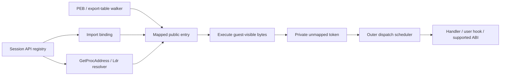

# Unified Windows API addresses

Speakeasy gives each synthesized API function a stable, readable executable address in its owning module. The export table, bound imports, `GetProcAddress`, `LdrGetProcedureAddress`, and kernel routine lookup use the same session registry. Registering a handler or user hook changes dispatch behavior without changing an existing address.

This makes the returned pointer a useful debugger breakpoint and symbol address. A guest can read or patch the entry; its bytes execute before Python handles the call. Memory tracing observes execution and never decides whether to intercept a function.

Forwarder strings follow PE forwarding rules to the destination entry. Dynamic-only requests enter through the registry and resolver; they deliberately have no export-table entry.

## Modules and export surfaces

`ApiModuleLoader` takes the names and ordinals of a module from its physical export manifest when one exists. Otherwise it combines exact DLL declarations from the signature database with explicit function and data handlers. Enumeration is independent of generic ABI support: an unsupported declaration still appears in the EAT and has a breakpointable entry. Architecture-ineligible declarations are excluded. The loader does not manufacture A/W variants.

The generated PE has a read-only header and export directory, executable `.text` and `.dyn` sections, and writable `.data`. Name pointers are sorted, name ordinals index the EAT correctly, and explicit sparse ordinals retain real holes. Code and data are different export kinds. An empty placeholder is still a mapped PE with valid headers and a reserved dynamic arena.

Each file `speakeasy/resources/win32/exports/<arch>/<module>.json` records the export directory of one real Windows binary: ordinals, names, forwarder strings and code or data kind, with the file version and SHA-256 of the source binary. The bundled manifests come from Windows Server 2025 (10.0.26100), with x64 modules from System32 and x86 modules from SysWOW64. `speakeasy/resources/win32/exports/README.md` describes their source and format. When a manifest exists, its names and ordinals define the EAT, including ordinal-only entries, so an ordinal import reaches the same function as on that build. Handler names that the manifest does not list get ordinals after the highest physical ordinal. A handler name whose A or W variant is in the manifest is not exported, because it exists only for dispatch. A manifest data export gets 0x100 zeroed writable bytes unless a data handler initializes it. Manifest forwarders are recorded but not applied: a forwarded name is a local entry.

Kernel modules and user modules without a manifest use the signature catalog. Win32metadata records import-library declarations, which omit undocumented physical exports, and PHNT declarations do not supply ordinals or forwarders. For these modules, generated ordinals are deterministic emulator identifiers unless a handler supplies an explicit ordinal. CRT `_fmode`, `_commode`, and `__initenv` are explicit writable data exports; their pointer accessor functions return the same shared storage. Known PHNT architecture restrictions are curated; remaining unqualified declarations have inferred availability.

`PeLoader` preserves native export RVAs, ordinals, data, aliases and forwarder strings. Its exports execute guest code, even when a same-named Python handler exists. Native files selected through configured module paths use this guest policy; there is no automatic mixture of native instructions and handler interception. A guest image cannot acquire invented exports. Rebase requests require relocation data, and architecture mismatches fail before mapping.

## Public entries and private dispatch

Each synthesized function occupies a 32-byte slot. The first 16 bytes are NOP padding for patches, and the public entry starts at offset 16. The original entry is stack-neutral:

| Architecture | Public bytes |
| --- | --- |
| x86 | `8B FF` (`mov edi,edi`), `0F 1F 00` (NOP), then `E9 rel32` |
| x64 | `66 90`, followed by `FF 25 00 00 00 00` and an embedded 64-bit target |

The jump goes to a unique, permanently unmapped private token. The private reservation is 1 MiB with 16-byte token spacing. It is separate from the SEH and other control addresses. Allocation is monotonic, including after a failed load, so retired tokens cannot become a different API.

The invalid-memory dispatcher recognizes private controls before user fault hooks. An expected API fetch stops Unicorn and returns control to the outer execution loop. Python dispatch then runs outside the native callback. This avoids mapping fake API pages and makes breakpoint, step, interrupt and library-notification ordering explicit. Unregistered targets or data accesses in the reservation suspend native execution and deliver an ordinary access violation to guest SEH outside the callback. Unhandled accesses produce `invalid_read`, `invalid_write` or `invalid_fetch`. SEH can redirect PC or repair registers, but exception recovery never maps the reservation. The first five x86 bytes comprise whole instructions, allowing a five-byte inline hook to copy them into a trampoline and resume at the jump.

A host or debugger patch invalidates Unicorn's translated code cache. Patching a public entry to return or jump elsewhere executes those guest bytes and can bypass handler dispatch. A suspended call retains its entry bytes, SP and return slot; editing its frame or public code abandons the retained dispatch and executes the revised entry.

Real forwarders resolve through destination modules, names or ordinals, with cycle and depth checks. Missing destinations are not silently synthesized. Synthetic forwarder specifications retain real EAT forwarder strings rather than overwriting them with code. A forwarder may resolve to guest code or shared data storage.

## Dynamic-only requests

Each synthetic image reserves a 64 KiB `.dyn` arena, enough for 2,048 additional entries. Name and ordinal requests have separate keys. Repeated resolution reuses the same address. New entries never change the module's EAT, `SizeOfImage`, section layout or existing pointers.

An empty unknown placeholder can resolve dynamic-only functions. For a populated known surface, a procedure lookup for a name that is not exported fails unless the name has a supported declaration for that DLL, `functions_always_exist` is set, or an explicit user hook permits synthesis. A declared name therefore resolves even when the physical manifest lacks it, because other Windows builds export it. A failed `GetProcAddress` sets `ERROR_PROC_NOT_FOUND`. Static/injected import binding and the explicit `get_proc` interface permit dynamic placeholders for missing synthetic exports, preserving a meaningful address and later unsupported-call diagnostic. Guest PEs always remain strict. Capacity exhaustion or guest modifications to arena bytes/protections fail allocation without moving existing entries.

`functions_always_exist` permits dynamic resolution. It also enables the fallback for completely undeclared functions: treat the call as a 4-argument stdcall function, log those arguments, and return 1. This guess lets execution continue. On x86 it corrupts the stack when the real argument count differs. Known declarations rejected by the execution gate never enter the unknown-function fallback. Other unsupported calls log a diagnostic and stop.

## Signature and handler dispatch

Generic dispatch uses an exact module/name/architecture declaration with source precedence. Permissive cross-DLL signature lookup remains available for formatting arguments of implemented handlers, but cannot select an unknown function's execution ABI.

When several export names share one address, dispatch and telemetry use the first registered name, because an address alone does not identify the name a caller used to find it. Hooks match that name.

The generic execution gate supports scalar/pointer cdecl and stdcall declarations it can transport correctly, with the corresponding Win64 integer/pointer ABI on x64. It rejects skipped declarations, variadic calls, unsupported conventions, floating-point transport, by-value aggregates, and x86 64-bit returns. These functions remain visible and can have explicit handlers or hooks. Exceptions raised by providers during dispatch lookup are reported with the requested DLL and function rather than silently selecting another source's ABI. Bundled archive loading treats unreadable or malformed archives as unavailable sources.

Dispatch records API events against the originating run. A handler that changes PC, SP, return address or run ownership is not automatically returned a second time. Stack-transforming handlers perform their own return. A handler that changes SP while leaving PC on the dispatch trap, without scheduling a callback or lifecycle transfer, ends the run once with `api_handler_did_not_return`; it is not redispatched in a loop. Typed callback frames preserve the originating API's return slot, stack, calling convention and result across queued and nested guest callbacks. API telemetry reflects the result after a deferred initialization failure.

## Loader and process integration

An image owns one contiguous mapped span. Regions are validated and written inside that span, exports are registered, imports are bound, and section permissions are applied before publication. Public module-change notifications occur after each image load. Listener exceptions are logged independently and do not undo committed loads or prevent other listeners from running.

`PeLoader` defaults to lenient parsing of optional import/export inventories: malformed delay directories, invalid export entries, and malformed forwarders produce warnings and are omitted from the inventory. Non-ASCII DLL names use lossless Latin-1 decoding. Guest header bytes remain available for inspection. Image mapping bounds, architecture checks and relocation requirements remain mandatory. Set `modules.strict_loading=true`, or construct `PeLoader(strict=True)`, to reject these malformed inventories. The module setting also requires complete static/injected import resolution. Mandatory checks reject impossible mappings (including section extents beyond `SizeOfImage`), inconsistent machine/optional-header architectures and rebasing without relocations; dropping optional inventories cannot make those mappings coherent.

Static imports retain their original thunk/IAT positions when pefile filters a malformed function name. Skipped slots remain unchanged; valid later entries bind to their own slots. The inventory honors pefile's validated IAT fallback for an empty/unreadable OriginalFirstThunk, rejects reserved ordinal bits, and bounds raw nonzero-slot work across descriptors while allowing terminating NUL lookahead. Synthetic module construction retains a non-ASCII module's actual name, path and registry identity, using an ASCII label only inside its generated PE export directory.

Ordinary and delay imports share the import inventory and binder. Native delay imports are bound eagerly; legacy VA-form descriptors are handled when rebasing. Injected import repair validates architecture and bounds descriptor, thunk and string reads by the mapped image. Injected repair resolves and validates all import slots before committing writes. Invalid slots keep their original bytes, and in strict mode any validation failure leaves the whole IAT unchanged. Binding bookkeeping is separate from callable address ownership.

Each process has its own loader lists. List heads are real sentinels with reciprocal forward/back links, including empty lists. The main image is first in load/memory order and excluded from initialization order. PEB allocation attaches every visible module that is loaded at that time, and a runtime library load attaches the new module to the current process. Allocating another PEB does not replace the running thread's FS/GS PEB pointer.

Speakeasy uses a shared emulated address space, so module data can remain shared between processes. Complete Windows reference counting, API-set schema/build fidelity, native TLS semantics, special `LoadLibraryEx` mapping modes and DLL unload notifications are not modeled.

## Debugger limits and symbols

A resume or step is one logical action across private yields. Stepping the final trampoline jump completes the intercepted call or guest transfer without executing a caller instruction. Pending watchpoints or interrupts stop before dispatch. Memory watchpoints stop at a completed instruction boundary so resuming does not repeat a guest write.

Instruction limits are per run and persist across debugger actions and API yields. Synthesized guest instructions count; Python handling does not. Active execution time is cumulative within one run across API yields, including Python handling. The timeout does not apply while a debugger is attached. Every queued entry point, fresh shellcode run, and public `Speakeasy.call()` starts a new per-run timeout budget. Python handlers are measured cooperatively after returning, so a blocking host hook can overshoot the deadline. Initial loading and preparation outside execution are excluded; runtime loads and scheduler work inside active execution consume the budget. `max_runs` caps queue length. Timeout/instruction exhaustion produces a typed stop rather than passing zero to Unicorn as an unlimited budget. Completed callback/run-return controls are finalized even at an exact instruction boundary. Capped execution uses exact Python instruction accounting across API yields, with Unicorn's native count also bounding each invocation. This adds overhead when `max_instructions` is set. Unicorn has no interface that reports the consumed instruction count, and block-count estimates miscount REP iterations and partial blocks. [Unicorn 2.1.4 maintains and resets that counter internally](https://github.com/unicorn-engine/unicorn/blob/2.1.4/uc.c#L987-L1024).

`Speakeasy.get_symbols()` returns a `{address: (dll, name)}` snapshot that combines registry exports and dynamic entries with auxiliary kernel symbols. Registry ownership takes precedence at a duplicate address. `get_symbol_from_address(address)` resolves public entries, trampoline interiors and exact auxiliary kernel symbols. `Speakeasy.get_api_symbols()` returns a snapshot of mapped function/data labels, including dynamic-only entries and internal callback entries. It excludes private tokens and EAT forwarder strings. Take a new snapshot after resolving additional modules or functions; PE exports alone intentionally omit dynamic-only symbols.

Genuine memory faults remain terminal for the current run after debugger inspection. Register or PC edits at those fault stops do not make the run resumable. By default, analysis recovers from execution of non-executable anonymous and guest-module memory, including packers that execute decrypted `.data` bytes. This is a coverage policy rather than a complete Windows DEP policy model; it applies independently of architecture and NXCOMPAT. Default recovery grants execute permission to the faulting guest PE page after Unicorn unwinds, retaining its read/write permissions. This avoids repeated protected-fetch faults without changing protections inside a native callback. Debugger fault stops and synthetic API section permissions remain authoritative. Fault completion waits for native execution to unwind so errors cannot be attributed to the next queued run.

The SEH repeated-fault limit holds across handler returns. Handler/filter execution does not establish progress: the guard resets after resumed guest execution advances, a different fault key, or a fresh run. An unrepaired identical fault ends with its ordinary memory error rather than repeatedly dispatching handlers until timeout. This bounds replay; it does not implement complete C++ exception semantics or recovery-page lifetime. Same-PC partial progress such as REP remains a fidelity limit.

## Fidelity limits

Synthetic stubs are identical except for their private targets. Nt/Zw names are not inferred to be same-address aliases, and no real syscall numbering or ntdll layout is modeled. FreshyCalls, Halo’s Gate and similar layout-based resolution require versioned native fixtures or explicit handlers. A PE export ordinal base is a DWORD and the image builder can represent that range; GetProcAddress-style ordinal requests and forwarded ordinal syntax use the Windows 16-bit ordinal interface. Generated ordinals in the bundled catalogs stay within that callable range.

The private reservation is not a guest code or data surface; data probes fault and may be handled by existing guest SEH. Windows x64 unwind-based SEH remains unsupported.
